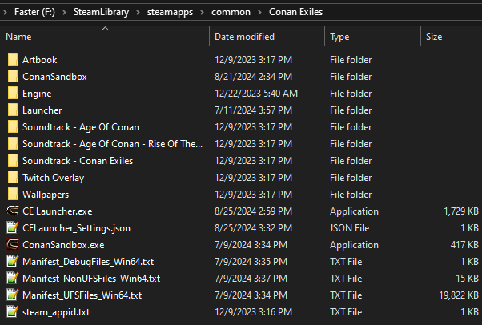
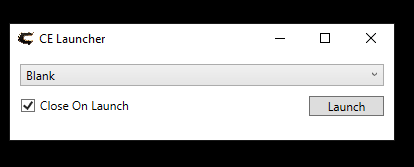
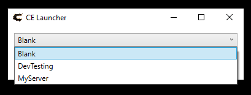

# CE Launcher

CE Launcher is a utility designed to make it easier to change `modlist.txt` for Conan Exiles.

## Installation

1. Download the CE Launcher executable.
2. Place the executable in your Conan Exiles folder.

That's it! You're ready to use CE Launcher to easily manage your `modlist.txt`.

